# 使用Azure AD作为外部身份验证提供程序

要使用AzureAD对用户进行身份验证，您必须启用和配置 `OrchardCore.MicrosoftAuthentication.AzureAD` （您可以在此了解更多信息[](../../reference/modules/Microsoft.Authentication/README.md)）和`OrchardCore.Users.Registration` 功能。

## 您将构建什么

您将构建一个博客，允许用户使用其AzureAD帐户登录，并基于安全组分配角色

## 您将需要什么

按照[创建新的Orchard Core CMS网站](../../guides/create-cms-application/README.md)的指南进行操作

已配置Azure Active Directory的Azure帐户。

## 登录OrchardCore管理员帐户并启用所需功能

转到<https://localhost:5001/Admin/Features>并启用“ Microsoft身份验证Azure Active Directory”和“用户注册”功能。

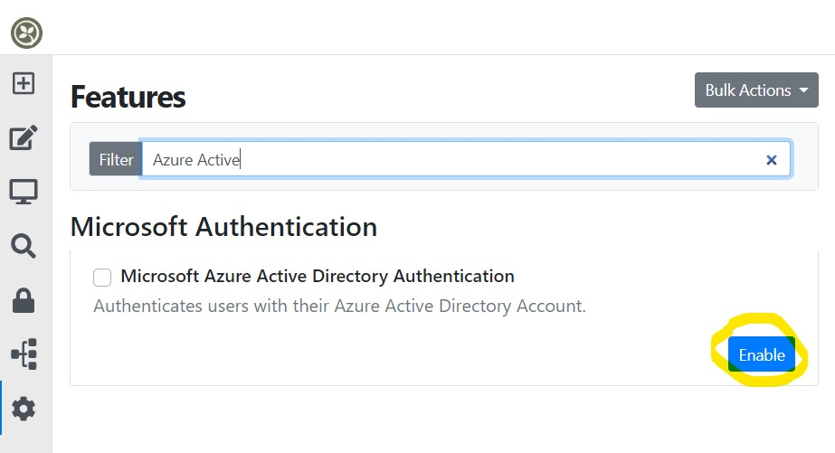
## 登录Azure门户以配置目录

在[Azure门户](https://portal.azure.com/#blade/Microsoft_AAD_IAM/GroupsManagementMenuBlade/AllGroups)中创建你想要管理/分配的Orchard Core角色作为安全组。复制对象ID，因为稍后需要使用它进行映射。

创建后的安全组如下图所示。

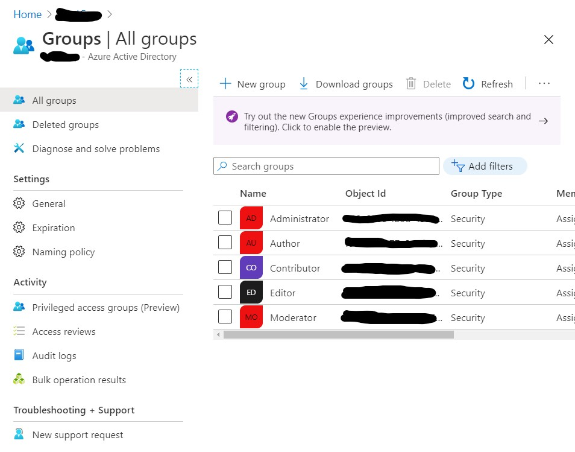

在[Azure门户](https://portal.azure.com/#blade/Microsoft_AAD_IAM/ActiveDirectoryMenuBlade/RegisteredApps)中[注册一个新应用程序](https://portal.azure.com/#blade/Microsoft_AAD_IAM/ActiveDirectoryMenuBlade/RegisteredApps)，并进行身份验证配置，

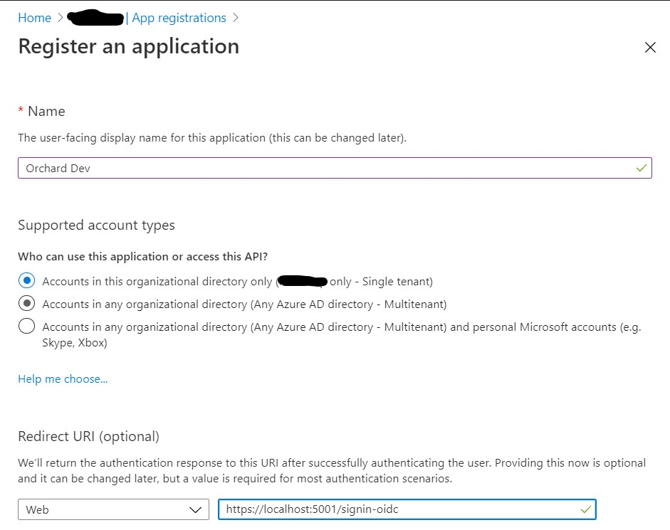

确保提供重定向URI，并至少启用ID令牌的发行。

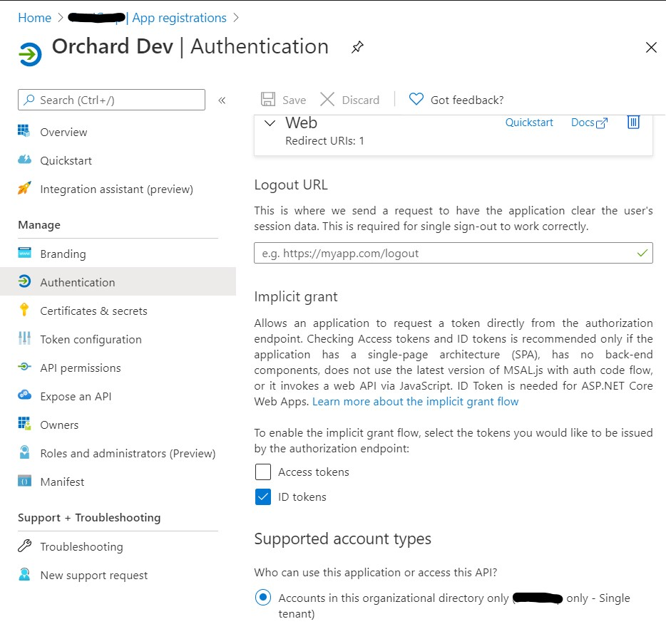

转到令牌配置并添加组令牌，如下图所示。

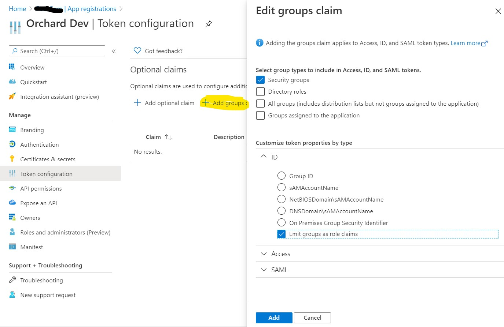
在同一个屏幕上，点击“添加可选声明”，选择`ID`，勾选`电子邮件`，如下图所示，然后点击添加：

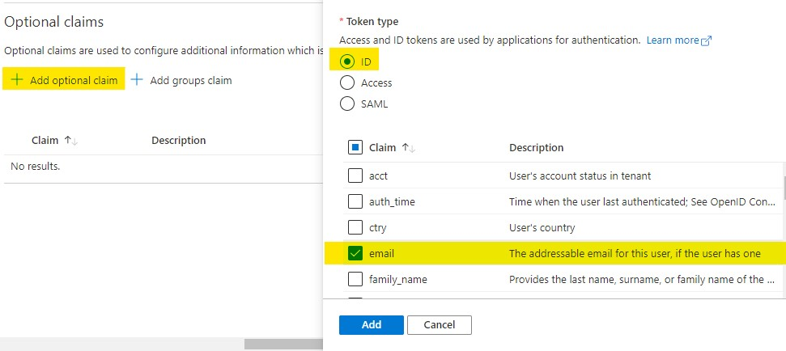

可能会弹出一个窗口请求授权调用Graph API。勾选“打开Microsoft Graph电子邮件权限”，如下图所示，然后点击“添加”：

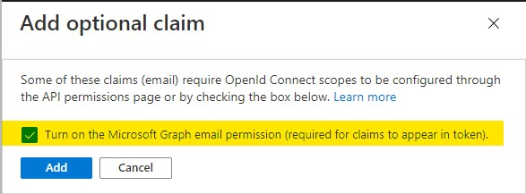

最后一步是从Azure门户中复制应用程序ID和租户ID。

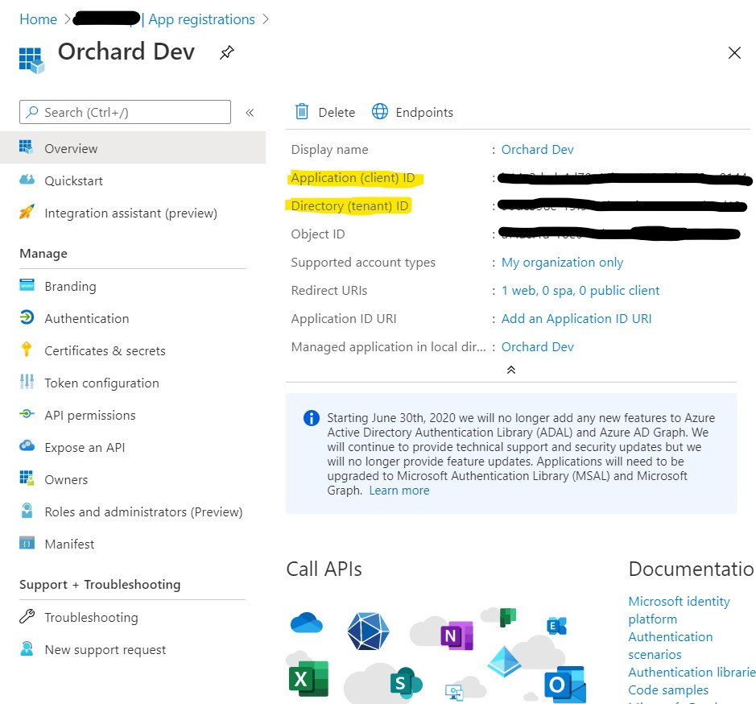

在OrchardCore Admin中，[导航到Security/Azure Active Directory](https://localhost:5001/Admin/Settings/OrchardCore.Microsoft.Authentication.AzureAD)来配置AzureAD应用程序。

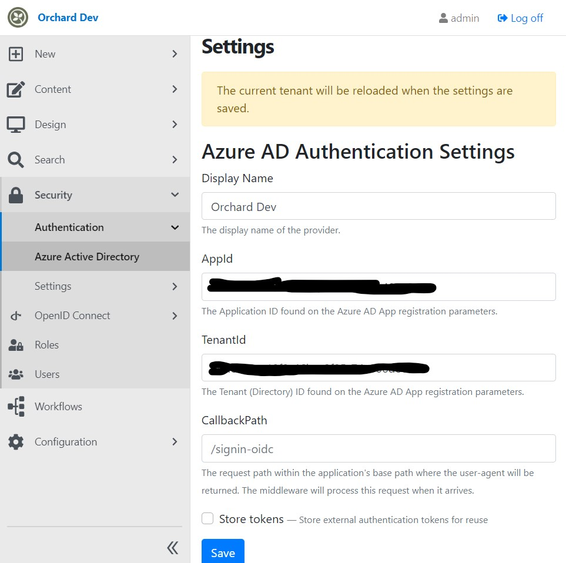

## 配置注册设置

[导航到Security/Settings/Registration](https://localhost:5001/Admin/Settings/RegistrationSettings)并启用注册，如下所示
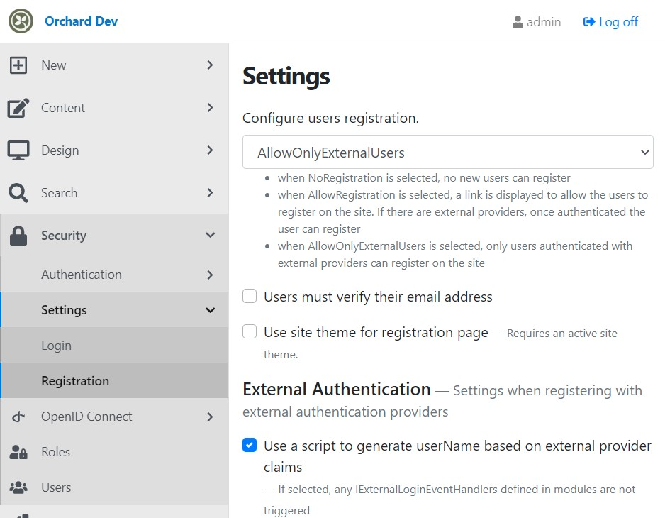

勾选“使用脚本基于外部提供程序声明生成用户名”，并复制以下脚本以发现并使用用户主体名称作为用户名（如果用户不存在）

```javascript
switch (context.loginProvider) {
    case "AzureAD":
        context.externalClaims.forEach(claim => {
            if (claim.type === "http://schemas.xmlsoap.org/ws/2005/05/identity/claims/upn") {
                context.userName = claim.value;
            }
        });
        if (!context.userName){
            context.userName = "azad" + Date.now().toString();
        }
    break;
    default:
        log("Warning", "Provider {loginProvider} was not handled", context.loginProvider);
    break;
## 配置注册设置

前往 [Security/Settings/Registration](https://localhost:5001/Admin/Settings/Registration) 页面，并确保禁用了在首次注册时询问用户信息的设置。

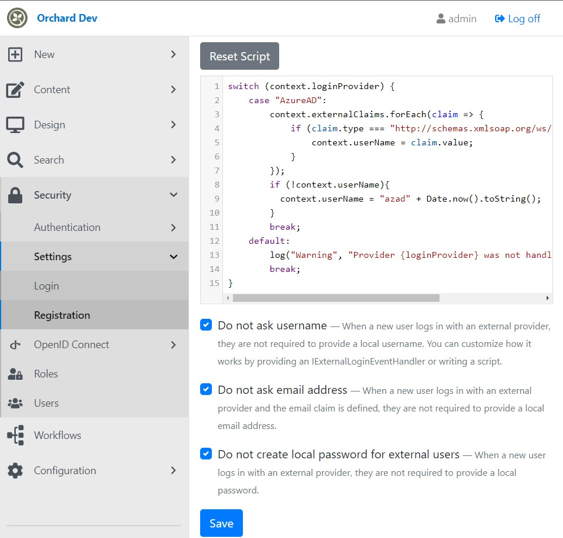

## 配置登录设置

前往 [Security/Settings/LoginSettings](https://localhost:5001/Admin/Settings/LoginSettings) 页面，并勾选“使用脚本基于外部提供者声明设置用户角色”选项，然后将以下脚本复制到页面中：

```javascript
switch (context.loginProvider) {
    case "AzureAD":
        context.externalClaims.forEach(claim => {
            if (claim.type === "http://schemas.microsoft.com/ws/2008/06/identity/claims/role") {
                switch (claim.value) {
                    case "<replace AdministratorObjectId>":
                        context.rolesToAdd.push("Administrator");
                        break;


```
case "<replace ModeratorObjectId>":
      context.rolesToAdd.push("Moderator");
      break;

case "<replace EditorObjectId>":
      context.rolesToAdd.push("Editor");
      break;

case "<replace ContributorObjectId>":
      context.rolesToAdd.push("Contributor");
      break;

case "<replace AuthorObjectId>":
      context.rolesToAdd.push("Author");
      break;

default:
      log("Warning", "Role {role} was not handled", claim.value);
```

在这段代码中，我们可以看到一个`switch`语句，以及一些`case`语句。

在每个`case`中，都将一个特定的角色名称添加到`context.rolesToAdd`数组中。

如果`claim.value`的值不在上面的`case`中，那么就会执行`default`语句，并通过日志记录警告信息。

然后，`context.userRoles`中不存在于`context.rolesToAdd`中的任何角色名称都将被添加到`context.rolesToRemove`数组中。
# 在 OrchardCore 中使用 Azure Active Directory 进行身份验证

在此教程中，我们将介绍如何在 OrchardCore 中集成 Azure Active Directory（以下简称 AAD）作为身份验证提供程序。

## 前提条件

- 在 [Azure 门户](https://portal.azure.com/) 中拥有有效的 AAD 租户
- OrchardCore CMS已经安装并且可用

## 设置 Azure AD

1. 在 Azure 门户中创建一个新的应用程序；指定名称并选择“Web”类型。
2. 单击“App注册”按钮，记录应用程序ID和秘钥。
3. 在“API权限”选项卡中，单击“添加权限”，选择“Microsoft Graph”。
4. 选择`user.read`和`email`范围。
5. 单击“授权”选项卡并授予所需的权限。

## 启用 OrchardCore 外部登录

为 OrchardCore 启用外部登录的方式有多种。我们这里按照 OrchardCore 在线文档中的方式进行设置。

1. 打开 OrchardCore CMS 并登录为管理员。
2. 转到 Configuration > Auth。
3. 将 "Enable the external authentication provider" 和 "Allow unencrypted communication with external providers" 设置为 true。
4. 选择"Azure Active Directory"作为"Provider Name"。
5. 输入“ClientId”和“ClientSecret”，并使用在 Azure 门户中创建应用程序时记录的值。
6. 将“Authority”设置为 https://{your-aad-tenant-name}.b2clogin.com/{your-aad-tenant-name}.onmicrosoft.com/{policy-signin}/v2.0/.policy-signin应该包含标识提供程序策略的名称。
7. 将“TokenValidationParameters”设置为`"NameClaimType": "name"`。
8. 单击“Save”以保存设置。

## 更新登录控制器

我们还需要在 OrchardCore 中更新默认的登录控制器以允许使用新的外部提供程序。

打开 `IDisplayManager.cs` 文件，将以下代码添加到类中：

```csharp
private static (string iconClass, string providerName) ToIconAndName(LoginProviderDescriptor descriptor)
{
    var iconName = descriptor.ProviderName.ToLowerInvariant();
    iconName = string.Concat(iconName.Select((x, i) => i == 0 ? char.ToUpperInvariant(x) : x));

    return ($"fa fa-{iconName}", descriptor.DisplayName);
}
```

现在打开 `OrchardCore.Users.Controllers/UserController.cs` 文件并找到 `AdminLogin` 方法。在这个方法中，找到类似于以下代码行的部分：

```csharp
foreach (var provider in _schemes.Where(s => !string.IsNullOrEmpty(s.Name) && s.Name != IdentityConstants.ApplicationScheme))
{
    buttons.Add(new LoginProviderButtonModel
    {
        AuthenticationScheme = provider.Name,
        DisplayName = provider.DisplayName,
        IconClass = "fa fa-unlock-alt",
        AreaName = "OrchardCore.Users",
        ActionName = nameof(ExternalLogin),
        ControllerName = nameof(AccountController)
    });
}
```

将其替换为以下代码：

```csharp
switch (context.LoginProvider)
{
    case "AzureAD":
        var azureAD = _schemes.FirstOrDefault(x => x.Name.Equals("AzureAD"));
        if (azureAD != null)
        {
            buttons.Add(new LoginProviderButtonModel
            {
                AuthenticationScheme = azureAD.Name,
                IconClass = "fa fa-windows",
                DisplayName = azureAD.DisplayName,
                AreaName = "OrchardCore.Users",
                ActionName = nameof(ExternalLogin),
                ControllerName = nameof(AccountController)
            });
        }
        break;
    default:
        foreach (var provider in _schemes.Where(s => !string.IsNullOrEmpty(s.Name) && s.Name != IdentityConstants.ApplicationScheme))
        {
            buttons.Add(new LoginProviderButtonModel
            {
                AuthenticationScheme = provider.Name,
                DisplayName = provider.DisplayName,
                IconClass = "fa fa-unlock-alt",
                AreaName = "OrchardCore.Users",
                ActionName = nameof(ExternalLogin),
                ControllerName = nameof(AccountController)
            });
        }
        break;
}
```

## 检查结果

从 OrchardCore 中退出。导航到 <https://localhost:5001/admin> 并使用外部提供程序按钮登录。

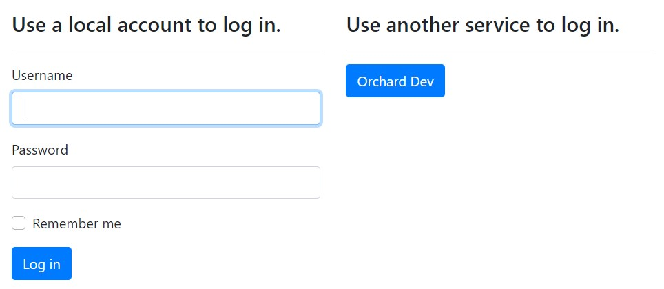

## 总结

您刚刚将 Azure Active Directory 集成到您的博客的管理中心！您可以尝试其他登录设置，例如禁用本地登录并将 AzureAD 提供程序挑战而不是显示登录屏幕。


> 该文档由Chat-GPT 翻译
