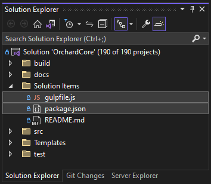
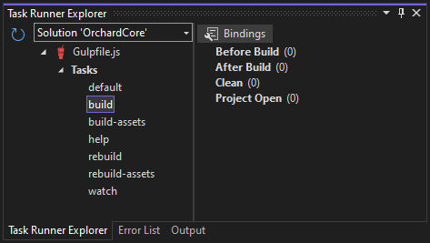

# Gulp Pipeline

Orchard Core 包含一个用于处理客户端资产（通常是脚本和样式表）的处理流水线，用于执行前端开发工作流任务，如转码、缩小和捆绑核心项目和扩展（即模块和主题）中的客户端资产。许多 Orchard Core 内置的模块和主题都使用此流水线来处理客户端资产，您也可以启用自己的扩展来使用它。

# 概述

客户端资产流水线由 [Gulp](http://gulpjs.com) 提供支持，Gulp 是一个基于 [Node.js](https://nodejs.org) 的流行的开源任务运行器，可以用于自动化开发工作流中的各种任务。该流水线定义了一组 Gulp *任务*，可以通过 Gulp 使用命令行或使用 Visual Studio 2022 或更高版本中的 **任务运行器资源管理器** 工具窗口执行。对于使用 Visual Studio Code 的用户，可以使用其终端。

从物理上讲，客户端资产流水线由 Orchard Core 解决方案文件夹中的两个文件组成：

- `src/package.json` 包含有关流水线所需的 Node 包的信息。此文件告诉 Node 包管理器（NPM）需要下载和安装哪些包，以便流水线能够正常工作。
- `src/gulpfile.js` 包含定义一组 Gulp 任务及其实现逻辑的 JavaScript 代码。

在 Visual Studio 中，您可以在一个名为 `Solution Items` 的解决方案文件夹中的 **解决方案资源管理器** 中找到这些文件：



实现解决方案级别的流水线而不是在每个需要处理客户端资产的扩展中实现流水线的原因有以下几个：

* 当前和未来的扩展可以共享现有的流水线逻辑，而不必重新发明它。
*只需要下载并将必要的 Node.js 包与代码库放在一起即可。
* 将 Node 包文件夹（`node_modules`）放在 `OrchardCore.Cms.Web` 项目中的任何位置都会在发布 Orchard 时包括它们的内容，这会使发布包的大小增加几个数量级，尽管这些文件仅在开发时有用。

默认情况下，客户端资产管道未配置为在打开或构建 Orchard Core 时自动调用。为了最小化构建时间并使开始使用 Orchard Core 尽可能简单，Orchard Core 中的所有内置模块和主题都保存在源控制中，并包括其处理过的输出文件。这意味着您无需激活和运行客户端资产管道即可开箱即用地构建或运行 Orchard Core。仅在更改这些资产或希望使用它来处理自己的扩展资产时，才需要运行客户端资产管道。

# 入门指南

## 安装先决条件

客户端资产管道要求安装 Node.js。如果您使用的是 Visual Studio 2022 或更高版本，则通常已作为 Visual Studio 的一部分安装了 Node.js。如果您未使用 Visual Studio，或者在安装 Visual Studio 时选择了不包含 Node.js，则需要从 https://nodejs.org 手动安装 Node.js。

接下来，您将需要使用 NPM 安装所有客户端资产管道所需的包，包括 Gulp 本身。使用命令行，导航到 Orchard Core 解决方案文件夹并执行命令 `npm install`，它将安装 `package.json` 文件中引用的所有依赖项。在 Visual Studio 2022 或更高版本中，您也可以只需打开 `package.json` 文件并保存它而不进行任何更改，这将在幕后触发自动的 `npm install`。

## 执行任务

有三种不同的 Gulp 任务可以调用以不同的方式执行管道。

- **build** 对解决方案中的所有资产组执行增量构建；其输出已经比所有输入更新的资产组不会被处理。
- **rebuild** 对解决方案中的所有资产组执行无条件的完全构建，即使它们的输出已经比其输入更新。
- **watch** 监视解决方案中的所有资产组，以检测其输入是否有更改，并在资产组被修改时重新构建。


注意：这些任务在评估更改时也考虑到资产清单文件本身；对资产清单文件（`Assets.json`）的修改与对清单中声明的任何输入资产文件的修改一样处理。

通常执行 Gulp 任务的方式取决于您是否使用 Visual Studio。

### 使用命令行

1. 确保已安装Node.js并将其添加到 `PATH` 变量中。
2. 确保已使用上面描述的 `npm install` 命令安装了所有必需的 Node.js 包。
3. 导航到 Orchard Core 解决方案文件夹，在其中找到 `gulpfile.js` 文件。
4. 执行以下命令之一 `gulp build` 、 `gulp rebuild` 和 `gulp watch` ，以执行相应的 Gulp 任务。

### 使用 Visual Studio

Visual Studio 2022 及更高版本提供了一个名为“任务运行器浏览器”的内置工具窗口，可以用于执行 NPM 任务以及来自不同任务运行器（例如 Gulp 和 Grunt）的任务。

要打开任务运行器浏览器，请选择菜单中的 **查看 -> 其他窗口 -> 任务运行器浏览器**。或者，您可以右键单击“解决方案资源管理器”中的 `gulpfile.js` 文件，然后从下拉菜单中选择 `任务运行器浏览器`。

首次进入任务运行器浏览器时，您可能会看到一个错误消息：
如果您没有安装必要的依赖包（请参见上面安装先决条件的部分），或者如果您最近安装了依赖包并且任务运行器资源管理器尚未在此之后重试Gulp文件的解析，则会出现此错误。安装所有依赖包后，只需单击刷新图标并等待其重新加载即可：


当任务运行器资源管理器正确解析Gulp文件后，您将看到其中包含的任务列表：



现在，您可以双击其中一个任务来执行它。

### 将任务绑定到 Visual Studio 事件上

任务运行器资源管理器还可以将任务“绑定”到响应Visual Studio解决方案事件自动执行的功能上。Orchard Core 没有预配置任何这样的绑定，因为原始代码库中的所有资产都已被处理，并且它们的输出已包含在源代码控制中，但是在开发自己的客户端资产或修改 Orchard Core 中的资产时，配置这些绑定可能很有用。

最常见的场景是将**build**任务绑定到**After Build**解决方案事件上。这样，每次你构建Orchard Core（例如，通过按下 `F5` 或 `Ctrl + F5` 或从菜单中选择**Build -> Build Solution**）时，资产管道的**build**任务将在构建过程结束时执行。任何其输入文件自上次构建以来已更改的资产组都将被刷新。

要配置此绑定，请按照以下步骤进行：
# 在Orchard Core中使用客户端资源流水线

Orchard Core包括了一个基于gulp.js的客户端Assets处理的流水线。本篇文档将指导你如何在Orchard Core中使用客户端资源流水线。

## 概述

客户端Assets处理的流水线用于优化，打包压缩和精简静态资源，如JavaScript，CSS和图片。这些资源文件通常包含在主题和模块中，并在客户端使用。

## 工作原理

流水线的核心是通过gulp执行一系列任务。Gulp被选为使用的原因是因为它是一个易于学习和使用的JavaScript构建系统，并且它的插件生态系统可以处理任何可能的客户端Assets处理任务。在Orchard Core中，它通常被用于：

- 将多个JavaScript或CSS文件打包到单个文件中
- 缩小，压缩和混淆JavaScript和CSS
- 缩小和转换图像

处理流水线其中的一个挑战是确保它可以正确得执行，同时也不会在开发或生产环境中引入任何不必要的性能问题。

## 用Visual Studio绑定Gulp任务

解决方案浏览器中右键点击 `build` 任务
点击 **Bindings**
选择 **After Build**
另一个常见场景是将 **watch** 任务绑定到 **Project Open** 解决方案事件，这将在加载解决方案时启动 **watch** 任务，并在终止任务之前一直运行。
注意：重要的是要知道，任务绑定存储在Gulp文件开头的一个特殊格式的注释中，因此当您配置任务绑定时，您实际上是对属于Orchard Core代码库的核心文件之一进行更改，如果您稍后选择将代码库更新到更高版本的Orchard Core，则可能会被覆盖。

## 为您自己的模块或主题使用流水线

您通常不必执行客户端资产流水线中的任何任务，除非您正在更改Orchard Core自身或创建自己的自定义扩展并希望利用流水线处理自己的客户端资产。本节解释了如何为自己的扩展启用流水线。

### 添加一个Asset清单文件

第一步是向您的扩展程序添加一个Asset清单文件。该资产清单文件是一个简单的JSON文档，声明要由流水线处理的一个或多个资产组。每个资产组指定了您的扩展程序中的一组输入文件（例如`.less`，`.scss`，`.css`，`.ts`或`.js`文件），以及一个输出文件和（可选的）一个或多个选项来影响处理。

要添加资产清单，请在您的扩展程序的根文件夹中添加一个名为`Assets.json`的新JSON文件（文件的名称和位置都是必须的）。客户端资产流水线将检测并解析此文件，并在执行流水线任务时，添加在其中声明的资产组进行处理。

资产清单的基本结构如下：
```js
[
    {
        // 第一组资源
        "inputs": [
            "some/input/file.less",
            "some/input/file2.less"
        ],
        "output": "some/output/file.css"
        // 可以在此添加选项
    },
    {
        // 重复添加更多资源组
    }
]
```

所有输入和输出路径都是相对于扩展根文件夹的。但是它们不必驻留在扩展文件夹中；可以使用`../`来解析扩展文件夹外的路径，完全受支持。在Orchard Core中，常见惯例是使用名为`Assets`的文件夹来包含输入资产文件，并将其与输出资产文件分开，但这不是必需的。
使用资产管道完全是可选的。如果您不在扩展的根文件夹中添加 `Asset.json` 清单文件，客户端端资产管道将简单地忽略您的扩展。

## 基本示例（单个输入文件）

以下示例将 LESS 样式表 `Assets/Styles.less` 在您的扩展中进行转录，并将其转换为输出文件 `Styles/Styles.css`：

```js
[
    {
        "inputs": [
            "Assets/Styles.less"
        ],
        "output": "Styles/Styles.css"
    }
]
```

在执行 **build** 或 **rebuild** 任务时，资产管道将对 `Styles.less` 执行以下任务：
- 将LESS转换为纯CSS
- 根据需要添加/删除供应商前缀
- 添加源映射（仅限非最小化输出）
- 添加静态信息头（仅限非最小化输出）
- 标准化行结束字符
- 进行最小化处理

执行**build**任务后，您的扩展的`Styles`文件夹将包含两个文件：

- `Styles.css`（非最小化输出附带内联源映射）
- `Styles.min.css`（最小化）

生成这些输出资产文件后，您可以像平常一样使用Orchard Core资源管理器从Razor视图中引用它们，通过在资源清单类中声明它们并使用其中一个`Require()`方法让其被引用，或者使用其中一个`Include()` 方法通过路径包含它们。

备注：生成的输出资产文件将不会自动添加到您的扩展项目（`.csproj`）文件中。如果您希望将输出资产文件保留在源代码控制中，您需要在首次生成它们后手动使用“Solution Explorer”将它们包含在项目中。有关何时何时不应这样做的一些提示，请参见下面的高级场景部分。

多个输入文件

您还可以在同一资产组中指定多个输入：
```js
[
    {
        "inputs": [
            "Assets/Grid.less",
            "Assets/Forms.less",
            "Assets/Type.less",
        ],
        "output": "Styles/Styles.css"
    }
]
```

这与上面的基本示例完全相同，不同之处在于所有三个输入文件将被捆绑到输出文件 `Styles.css` 和 `Styles.min.css` 中。

## 通配符

客户端资产管道还支持使用 [通配符模式](https://www.npmjs.com/package/glob#glob-primer) 来包括多个输入资产，而不必逐个指定每个资产。
以下示例处理了`Assets`文件夹及其子文件夹中所有扩展名为 `.js` 的文件，并将它们捆绑到单个 `Scripts/Scripts.js` 输出文件中：

```js
[
    {
        "inputs": [
            "Assets/**/*.js" // 在 Assets 文件夹或其子文件夹中包含所有 .js 文件
        ],
        "output": "Scripts/Scripts.js"
    }
]
```

## 为每个输入文件分别设置输出文件

在许多情况下，您可能希望以完全相同的方式处理众多输入文件，但将它们保留在单独的输出文件中。您可以为每个输入/输出文件对声明一个单独的资产组来实现此目的。但是，编写此类资产组可能非常繁琐和容易出错，尤其是在添加或删除资产文件时，对其进行维护的难度会更大，特别是在拥有大量资产文件时。

通过在资产组的输出文件路径中使用 `@` 字符，管线可以更轻松地实现这一点。`@` 字符禁用捆绑步骤，基本上相当于“当前正在处理的输入资产文件相同的文件名”。当与 glob 通配符组合使用时，这可以使您更轻松地管理资产：
在这个示例中，`Assets/Moment/Localizations` 文件夹中的所有 TypeScript 文件都将被处理，并生成一个与输出文件夹 `Scripts/Localizations` 中同名的单独的 `.js` 文件。例如，假设 `Assets/Moment/Localizations` 文件夹包含 `en-GB.ts`、`fr-FR.ts` 和 `sv-SE.ts`，则输出 `Scripts/Localizations` 文件夹将包含生成的文件 `en-GB.js`、`en-GB.min.js`、`fr-FR.js`、`fr-FR.min.js`、`sv-SE.js` 和 `sv-SE.min.js`。如果随着时间的推移添加或删除了本地化文件，则资产组会相应地隐式重新定义。

## 多个资产组

您可以在同一个资产清单中定义多个资产组，例如下面的示例： 

```js
{ // 第一个资源组
  "inputs": [
    "Assets/Bootstrap/Bootstrap.less",
    "Assets/Bootstrap/Theme.less"
  ],
  "output": "Styles/Bootstrap.css"
},
{ // 第二个资源组
  "inputs": [
    "Assets/Styles.less"
  ],
  "output": "Styles/Styles.css"
},
{ // 第三个资源组
  "inputs": [
    "Assets/JavaScript/Lib/**/*.js",
    "Assets/JavaScript/Admin/Admin.js"
  ],
  "output": "Scripts/Lib.js"
}
## 添加额外的文件进行监视

如上所述，`watch`任务可用于连续监视输入资源文件的更改，并自动重建受影响的资产组，以实现平稳高效的本地开发/测试工作流程。

在某些情况下，您可能希望`watch`任务监视除输入资产之外的其他文件。特别是在使用LESS/SASS导入或TypeScript `<reference>`或`import`关键字间接将文件包含到管道中时，通常需要这样做。

假设您有一个主要的SCSS样式表，看起来像这样：

```less
@import " Utils/Mixins.scss ";
@import " Utils/Variables.scss ";
@import " Utils/Type.scss "
```

在这种情况下，您可以在资产组中使用`watch`属性来指定另一组要监视更改的文件： 

```js
# Asset Pipeline 配置

在Web项目中，通常存在着大量的静态资源(如脚本和样式表等)。Asset Pipeline 可以帮助我们优化这些资源，减少下载时间，提升用户体验。 在这里我们会学习如何配置 Asset Pipeline。

## 配置项

Asset Pipeline 配置包含一个 JSON 对象。每个元素是一个 asset group，负责处理一组相关联的资源。 这是一个Asset Pipeline 配置的例子:

```
[
    {
        "inputs": [
            "Assets/Main.scss" // 该项导入了额外的 .scss 文件
        ],
        "output": "Styles/Styles.css",
        "watch": [
            "Assets/Utils/*.scss" // 还要监视这两个文件的变化
        ]
    }
]
```

配置中支持使用glob通配符。

## 支持的资源文件格式

客户端资源管道(pipelines) 可以处理*样式表资源*或*脚本资源*。

一个资源组(asset group)只能用于处理这两种资源中的一种，并且必须有相匹配的输出资源文件扩展名。处理样式资产的资源组(asset group)必须指定`.css`输出文件，而处理脚本资产的资产组必须指定`.js`输出文件。一个资源组可以包含混合类型的输入资产，只要它们可以处理为相同的输出文件类型（即只要它们都属于样式表或脚本家族即可）。
例如，您可以在针对`.css`输出文件的组中同时指定`.less`和`.css`输入资产，也可以在针对`.js`输出文件的组中同时指定`.ts`和`.js`输入资产，但不可以混合使用。如果尝试这样做，资产管道将抛出错误。

### 样式表资产

支持以下文件类型作为样式表输入资产：

* LESS（`.less`）
* SASS（`.sass`）
* SCSS（`.scss`）
* 纯CSS（`.css`）

样式表资产进行以下任务：

* LESS / SASS转换
* 供应商前缀规范化
* 内联源地图生成（除非禁用）
* 文件报头生成
* 行末标准化
* 捆绑（除非禁用）
* 代码缩小化

### 脚本资产

以下文件类型支持作为脚本输入资产：

* TypeScript (`*.ts`, `*.jsx`)
* 普通 JavaScript (`*.js`)

对脚本资产执行以下任务：

* TypeScript 编译
* 内联源映射生成（除非禁用）
* 文件头生成
* 行尾规范化
* 打包（除非禁用）
* 代码缩小化

注意：所有输入脚本资产都要经过TypeScript编译器处理，即使是普通JavaScript `.js`文件。这意味着资产管道将针对普通JavaScript文件中明显的语法错误抛出错误。这通常应视为优势，因为JavaScript错误可以在构建时捕获，而不是在运行时。
## 支持的选项

下面是在资产清单文件中指定的资产组可以指定的所有可能属性的详尽列表。

### `inputs`（必填）

要包含在资产组中的输入文件的数组。路径相对于资产清单文件。支持Glob通配符。单个条目必须用数组包装。

### `output`（必填）

要由资产组生成的输出文件。路径相对于资产清单文件。除非将`@`指定为基本文件名，否则所有输入将被捆绑到指定的输出文件中，例如`Scripts/@.css`，以跳过捆绑。还将自动生成带有`.min`后缀的压缩版本。

### `watch`

要监视更改的其他文件数组。路径相对于资产清单文件。支持Glob通配符。单个条目必须用数组包装。

### `generateSourceMaps`

设置为`true`，以在非压缩的输出文件中发出内联源映射，设置为`false`以禁用源映射。默认值为`true`。


### `flatten`

默认情况下，使用glob指定输入资产并使用`@`字符在输出文件路径中绕过绑定时，输出文件生成在相对于输入模式中第一个glob的相关输入资产相对位置相同。例如，假设您有以下输入资产：

* `Assets/Pages/PageStyles.less`
* `Assets/Widgets/LoginWidget/Login.less`

给定以下资产组定义：

```js
[
    {
        "inputs": [ "Assets/**/*.less" ],
        "output": "Styles/@.css"
    }
]
```

资产管道的默认行为将生成以下输出文件：
通常情况下，Asset Pipeline默认会将输出的文件保留与输入文件相同的文件夹结构和相对位置。比如这个例子中:

* `Styles/Pages/PageStyles.css`
* `Styles/Pages/PageStyles.min.css`
* `Styles/Widgets/LoginWidget/Login.css`
* `Styles/Widgets/LoginWidget/Login.min.css`

这可能并不总是期望的行为。 `flatten`属性可以被设置为 `true`，这样Asset Pipeline将会把输出的文件夹结构扁平化，并忽略输入资产文件的相对位置。在这种情况下，将`flatten`设置为`true`将会生成以下两个输出文件:

* `Styles/PageStyles.css`
* `Styles/PageStyles.min.css`
* `Styles/Login.css`
* `Styles/Login.min.css`

### `separateMinified`

默认情况下，缩小后的输出文件会与它们的非缩小的文件拥有相同的文件名并且加上 `.min` 扩展名:

* `Styles/SomeStyles.css`
* `Styles/SomeStyles.min.css`
高级场景

## Defining custom tasks

In addition to the tasks provided by the asset pipeline, you can define your own custom tasks. This can be useful if you have assets that require processing that is not supported out of the box. To define a custom task, you need to create a function that takes an input file stream and returns a new transformed stream. For example:

```js
function myCustomTask(inputStream) {
  return inputStream.pipe(myCustomTransform())
                      .pipe(gulp.dest(outputDir));
}
```

You can then register this task with the asset pipeline by calling the `registerCustomTask` method:

```js
assetPipeline.registerCustomTask('myCustomTask', myCustomTask);
```

This will make your custom task available in the `assets` configuration under the `tasks` array.

## Managing external assets

Sometimes, you may have assets that are not part of your internal project, but still need to be included in your application. For example, you may want to include a vendor library or a CSS framework like Bootstrap. One way to manage these assets is to manually copy them into your project and include them in your asset configuration. However, this can lead to version conflicts or updates being missed.

A better way to manage external assets is to use a package manager like npm or Yarn. These tools allow you to specify dependencies for your project and automatically download and install them. Once installed, you can include these assets in your asset configuration just like any other asset. For example, if you wanted to include Bootstrap in your project, you could run the following command:

```bash
npm install bootstrap --save
```

This will download and install the latest version of Bootstrap and add it as a dependency to your project's `package.json` file. You can then include the Bootstrap CSS and JavaScript files in your asset configuration:

```js
assets: {
  styles: [
    'node_modules/bootstrap/dist/css/bootstrap.css'
  ],
  scripts: [
    'node_modules/bootstrap/dist/js/bootstrap.js'
  ]
}
```

This will include the Bootstrap assets in your application and ensure that they are automatically updated when you run `npm update`.
## 排除输出文件从源代码控制中

当开发一个目标重分发并由第三方使用的扩展时，建议将生成的输出文件添加到包含扩展的`.csproj`文件中并包含在源代码控制中。Orchard Core代码库中的所有内置项目都采用了这种方法。这样，消费者在使用您的扩展之前，无需安装Node.js并执行客户端资产管道中的Gulp任务来生成所需的输出资产文件。

但是，当为内部使用开发扩展时，您还可以考虑将生成的输出文件留在`.csproj`文件和源代码控制之外，并依靠它们在需要时由客户端资产管道重新构建。这类似于您通常假定NuGet软件包管理器将用于在构建项目之前还原NuGet软件包引用。

这种方法有几个优点：

* 较小的版本控制足迹
* 由于忘记重建或提交它们的更改而导致不一致/陈旧输出资产的风险

在使用此方法时，您的扩展中的`Styles`和`Scripts`文件夹将始终保持在Solution Explorer中为空，尽管在磁盘上它们将包含输出文件，并且通常会配置Gulp任务绑定以确保在Visual Studio中构建解决方案时始终构建客户端资产。如果使用自动化构建系统，还通常会将步骤添加到构建脚本中，以确保在构建的同时执行“构建”或“重新构建”任务。

## 包含自定义扩展文件夹

Orchard Core具有从除了`OrchardCore.Modules`和`OrchardCore.Themes`文件夹之外的其他文件夹加载扩展的功能。如果您的扩展存储和从这样的自定义位置加载，客户端资产管道将无法自动检测到您的资产清单。这是因为，默认情况下，它仅在这些位置下的文件夹中查找`Assets.json`文件：

* `OrchardCore.Modules/`
* `OrchardCore.Themes/`
要将自定义位置添加到资产清单扫描中，请按照以下步骤操作：

1. 在 Visual Studio 或任何其他文本编辑器中打开文件 `src/gulpfile.js`。

2. 找到 `getAssetGroups()` 函数。

3. 此函数声明了一个 `assetManifestPaths` 数组变量。你可以在这里添加自己的通配符并合并结果数组。例如：

  ```js
  var assetManifestPaths = glob.sync("./src/OrchardCore.{Modules,Themes}/*/Assets.json", {});
  var customThemePaths = glob.sync("AnotherLocation/MyCompanyThemes/*/Assets.json"); // 自定义位置！
  assetManifestPaths = assetManifestPaths.concat(customThemePaths);
  ```
    
4. 保存并关闭文件。

Orchard Core 开发团队正在研究自动化此过程的方法。

# 客户端资产管道的演变
对于那些对客户端资源管道背后历史感兴趣的人，可以在 [问题 #5450](https://github.com/OrchardCMS/Orchard/issues/5450) 中找到最初的讨论，包括其开发原因和提议的解决方案。


> 该文档由Chat-GPT 翻译
