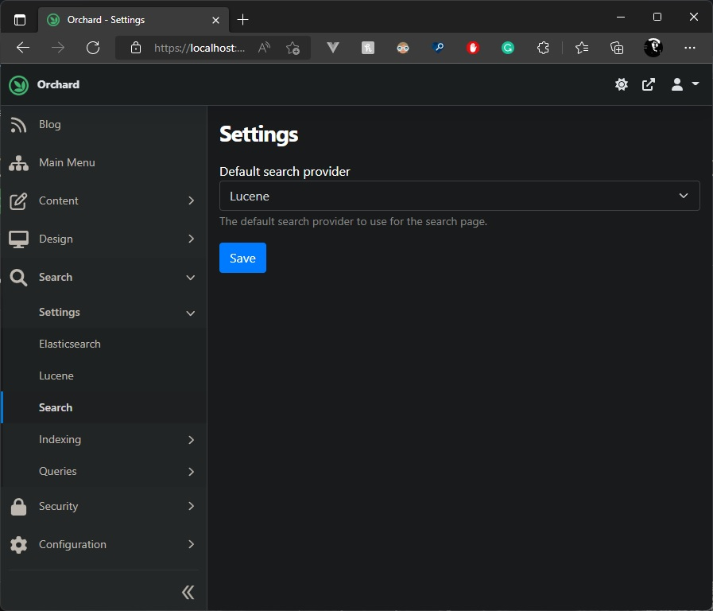

# 如何实现网站全文搜索

Orchard Core提供了一个Lucene和Elasticsearch模块/功能，可以在您的网站上进行全文搜索。大多数情况下，在构建网站时，您将需要在页面内容中进行搜索。但是，在Orchard Core中，您还可以使用Liquid在“内容类型”配置中配置要索引的文本/数据。本指南中的步骤是针对Lucene编写的，但使用Elasticsearch也可以实现相同的目标。

在进一步操作之前，请注意TheBlogTheme包括一个配方，可为您配置所有内容，而无需任何知识。

让我们逐步看看如何使其对您可用。

## 第一步：启用Orchard Core中的Lucene或Elasticsearch功能。


Orchard Core有3种不同的Lucene和Elasticsearch功能。您需要启用Lucene功能以创建Lucene索引。您需要启用Elasticsearch功能才能创建Elasticsearch索引。

## 第二步：创建Lucene或Elasticsearch索引


单击“添加索引”按钮。


`Lucene` 索引选项：

*索引名称* 用于识别索引。它会在 `/App_Data/Sites/{YourTenantName}/Lucene/{IndexName}` 中创建一个文件夹，其中包含索引时 `Lucene` 创建的所有文件。

第二个选项是此索引使用的 *分析器名称*。分析器是一个更复杂的功能，供高级用户使用。它允许您在索引文本时微调文本处理方式。例如，当您搜索包含“Car”时，您可能还希望在用户输入小写字母“car”时也有结果。在这种情况下，分析器可以使用小写过滤器对所有文本进行索引。有关分析器的更多详细信息，请参阅 Lucene.NET 文档。在 Orchard Core 中，默认情况下只提供了 *standardanalyzer*，它针对“英语”文化字符进行了优化。分析器是可扩展的，以便您可以使用 Lucene.NET 提供的分析器之一或自己实施的分析器。

参见：

https://github.com/apache/lucenenet/tree/master/src/Lucene.Net.Analysis.Common/Analysis

例如，您可以在自定义模块的 startup.cs 文件中使用以下示例向 DI 注册自定义分析器：

```csharp
using Microsoft.Extensions.DependencyInjection;
using OrchardCore.Search.Lucene.Model;
```
第三个选项是 *Culture*（文化）。默认情况下，将选择 *任何文化*。在这里，我们可以选择仅索引特定文化的内容项，或是所有文化的内容项。
*内容类型* ：您可以选择在此索引中解析的任何内容类型。

*索引最新版本* ：此选项将允许您仅索引已发布的项目或也索引草稿，如果您希望在自定义前端仪表板中搜索内容项，甚至在管理后端自定义模块中搜索内容项，则这可能很有用。默认情况下，如果我们不选中此选项，它仅会索引已发布的内容项。

*存储源数据*（仅限Elasticsearch）：默认情况下，此选项将设置为true，以便在Elasticsearch中存储“ _source”数据。取消选中此选项将允许禁用通过禁用它来在“ _source”字段中存储任何数据。[查看文档]（https://www.elastic.co/guide/en/elasticsearch/reference/current/mapping-source-field.html#disable-source-field）

## 第三步：配置搜索设置

！[搜索设置]（images / 4.jpg）

通过启用`Lucene`模块，我们还添加了一个新的路由映射到`/search`，这将需要一些设置才能正常工作。在创建新的Lucene索引后，首先要做的是在Orchard Core中配置搜索设置。在这里，我们可以定义应该用于网站上的`/search`页面的索引，并定义此搜索页面应使用哪些索引字段。通常，我们默认使用`Content.ContentItem.FullText`。

## 第四步：设置索引权限

！[匿名用户角色设置]（images / 5.jpg）

默认情况下，每个索引都受权限保护，因此如果您没有设置哪些索引应是公开的，则没有人可以查询它们。要使“Search”`Lucene`索引在您的网站上对*匿名*用户可用，您需要去编辑此用户角色并向其中添加权限。每个索引都将在此列在`OrchardCore.Search.Lucene Feature`部分中。
## 第五步：设置搜索提供者



从OC 1.5开始，您现在可以使用“搜索”功能来启用您的网站前端搜索。启用此功能后，它将添加一个新的管理菜单选项，以选择要用于前端搜索的索引提供者。Orchard Core将允许使用 `Lucene` 或 `Elasticsearch`。

## 第六步：测试搜索页面


在这个示例中，我使用了`TheBlogTheme`食谱来自动配置一切。因此，上面的屏幕截图是该主题的搜索页面结果的示例。

## 第七步：优化全文搜索


这里，我们正在看`Blog Post`内容类型定义。我们现在针对每个内容类型有一个部分来定义将包括作为`FullText`的一部分索引的内容项的哪一部分。默认情况下，内容项将索引“显示文本”和“正文部分”，但我们还添加了一个选项，供您自定义您想要包括在此`FullText`索引字段中的值。通过单击“使用自定义全文本”，我们允许您设置任何Liquid脚本。如示例所述，如果您想要通过子标题字段找到这个内容项，您可以添加`{{Model.Content.BlogPost.Subtitle.Text}}`。您可以使用此Liquid字段执行许多操作：索引标识符、固定文本或数字值等。

我们可以使用“使用自定义全文本”将Widget或Bag中的内容包含在全文本搜索索引中。例如，对于FlowPart中的Widget，我们应该使用此Liquid脚本：
```html

  {{ contentItem | full_text_aspect }}

```

或者简单地使用：

```html
{{ Model.Content.FlowPart.Widgets | full_text_aspect }}
```

## 可选项：搜索模板定制

您也可以通过覆盖下列文件为您的主题定制这些模板以满足特定需要：

`/Views/Shared/Search.liquid 或 .cshtml`（通用布局）  
`/Views/Search-Form.liquid 或 .cshtml`（表单布局）  
`/Views/Search-Results.liquid 或 .cshtml`（结果布局）
例如，您可以通过将“Summary”更改为“SearchSummary”并创建相应的形状模板来简单地自定义搜索结果模板以满足您的需求。

SearchResults.liquid：
```html

    <ul class="list-group">
        
            <li class="list-group-item">
                {{ item | shape_build_display: "SearchSummary" | shape_render }}
            </li>
        
    </ul>

    <p class="alert alert-warning">{{"没有这样的结果。" | t }}</p>

```


> 该文档由Chat-GPT 翻译
