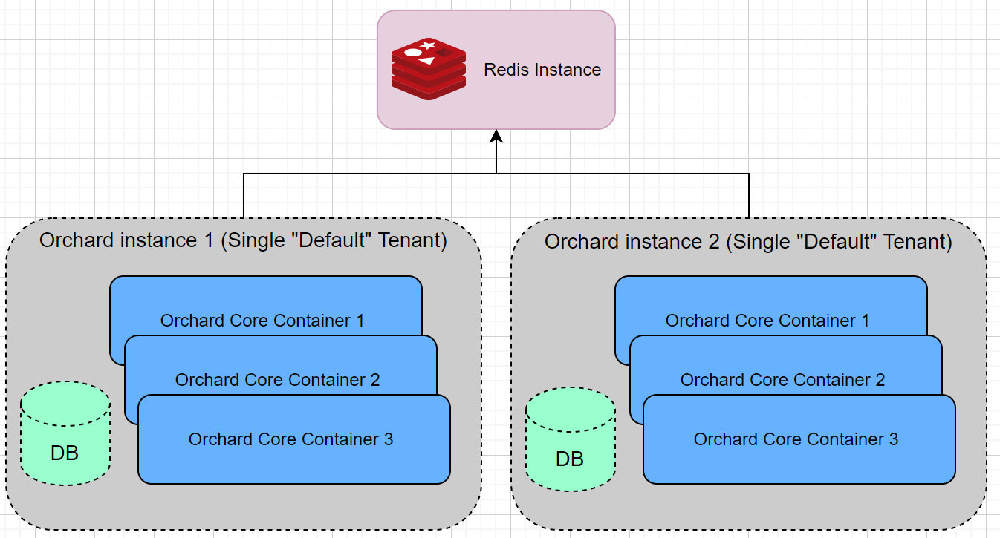

# 自动设置 (`OrchardCore.AutoSetup`)

自动设置模块允许在第一次请求时自动安装应用程序/租户。

## JSON 配置参数

自动设置参数在 appsettings.json 中定义。示例摘录：

```json
"OrchardCore": {
    "OrchardCore_AutoSetup": {
        "AutoSetupPath": "",
        "Tenants": [
            {
                "ShellName": "Default",
                "SiteName": "AutoSetup Example",
                "SiteTimeZone": "Europe/Amsterdam",
                "AdminUsername": "admin",
                "AdminEmail": "info@orchardproject.net",
                "AdminPassword": "OrchardCoreRules1!",
                "DatabaseProvider": "Sqlite",
                "DatabaseConnectionString": "",
                "DatabaseTablePrefix": "",
                "RecipeName": "SaaS"
            },
            {
                "ShellName": "AutoSetupTenant",
                "SiteName": "AutoSetup Tenant",
                "SiteTimeZone": "Europe/Amsterdam",
                "AdminUsername": "tenantadmin",
                "AdminEmail": "tenant@orchardproject.net",
                "AdminPassword": "OrchardCoreRules1!",
                "DatabaseProvider": "Sqlite",
                "DatabaseConnectionString": "",
                "DatabaseTablePrefix": "tenant",
                "RecipeName": "Agency",
                "RequestUrlHost": "",
                "RequestUrlPrefix": "tenant",
                "FeatureProfile": "my-profile"
            }
        ]
    }
}
```

| 参数 | 描述 |
| --- | --- |
| `AutoSetupPath` | 触发每个租户的自动设置的 URL。如果为空，则会在第一个租户请求时触发自动设置，例如： /，/tenant-prefix |
| `Tenants` | 要安装的租户列表。 |

| 参数 | 描述 |
| --- | --- |
| `ShellName` | 技术 shell/租户名称。它不能为空，且必须仅包含字符。对于默认租户，请使用“Default”。 |
| `SiteName` | 站点名称。 |
| `AdminUsername` | 超级用户的租户用户名。 |
| `AdminEmail` | 租户超级用户的电子邮件。 |
| `AdminPassword` | 租户超级用户的密码。 |
| `DatabaseProvider` | 数据库提供程序。 |
| `DatabaseConnectionString` | 连接字符串。 |
| `DatabaseTablePrefix` | 数据库表前缀。可用于在同一数据库上安装租户。 |
| `RecipeName` | 租户安装配方名称。 |
| `RequestUrlHost` | 租户主机 URL。 |
| `RequestUrlPrefix` | 租户 URL 前缀。 |
| `FeatureProfile` | 可选地，用于默认情况下使用的功能配置文件的名称。仅适用于使用“功能配置文件”功能。有关详细信息，请参阅租户模块的[文档](../Tenants/README.md#feature-profiles)。 |

!!! 注意
    租户数组必须包含 `ShellName` 等于 `Default` 的根租户。  
    每个租户都将按需安装（在第一个租户请求时）。  
    如果提供了 AutoSetupPath，则必须使用它来触发每个租户的安装，例如：
    `/autosetup` - 触发根租户的安装。
    `/mytenant/autosetup` - 自动安装 mytenant。

### 环境变量

由于 JSON 配置包含敏感信息，建议改用环境变量。

```
"OrchardCore__OrchardCore_AutoSetup__AutoSetupPath": ""

"OrchardCore__OrchardCore_AutoSetup__Tenants__0__ShellName": "Default"
"OrchardCore__OrchardCore_AutoSetup__Tenants__0__SiteName": "AutoSetup Example"
"OrchardCore__OrchardCore_AutoSetup__Tenants__0__SiteTimeZone": "Europe/Amsterdam"
"OrchardCore__OrchardCore_AutoSetup__Tenants__0__AdminUsername": "admin"
"OrchardCore__OrchardCore_AutoSetup__Tenants__0__AdminEmail": "info@orchardproject.net"
"OrchardCore__OrchardCore_AutoSetup__Tenants__0__AdminPassword": "OrchardCoreRules1!"
"OrchardCore__OrchardCore_AutoSetup__Tenants__0__DatabaseProvider": "Sqlite"
"OrchardCore__OrchardCore_AutoSetup__Tenants__0__DatabaseConnectionString": ""
"OrchardCore__OrchardCore_AutoSetup__Tenants__0__DatabaseTablePrefix": ""
"OrchardCore__OrchardCore_AutoSetup__Tenants__0__RecipeName": "SaaS"

"OrchardCore__OrchardCore_AutoSetup__Tenants__1__ShellName": "AutoSetupTenant"
"OrchardCore__OrchardCore_AutoSetup__Tenants__1__SiteName": "AutoSetup Tenant"
"OrchardCore__OrchardCore_AutoSetup__Tenants__1__SiteTimeZone": "Europe/Amsterdam"
"OrchardCore__OrchardCore_AutoSetup__Tenants__1__AdminUsername": "tenantadmin"
"OrchardCore__OrchardCore_AutoSetup__Tenants__1__AdminEmail": "tenant@orchardproject.net"
"OrchardCore__OrchardCore_AutoSetup__Tenants__1__AdminPassword": "OrchardCoreRules1!"
"OrchardCore__OrchardCore_AutoSetup__Tenants__1__DatabaseProvider": "Sqlite"
"OrchardCore__OrchardCore_AutoSetup__Tenants__1__DatabaseConnectionString": ""
"OrchardCore__OrchardCore_AutoSetup__Tenants__1__DatabaseTablePrefix": ""
"OrchardCore__OrchardCore_AutoSetup__Tenants__1__RecipeName": "Agency"
"OrchardCore__OrchardCore_AutoSetup__Tenants__1__RequestUrlHost": ""
"OrchardCore__OrchardCore_AutoSetup__Tenants__1__RequestUrlPrefix": "tenant"
```

为了测试目的，您可以将上述环境变量添加到 OrchardCore.Cms.Web 项目的 launchSettings.json 文件中的“web”配置文件中。  
然后，使用以下命令启动 Web 应用程序项目：

```
dotnet run --launch-profile web
```

## 启用自动设置功能

要启用自动设置功能，必须在 Web 项目的 Startup 文件中添加它：

```csharp
    public void ConfigureServices(IServiceCollection services)
    {
        services
            .AddOrchardCms()
            .AddSetupFeatures("OrchardCore.AutoSetup");
    }
```

此功能在源代码中包含的默认项目中默认启用，但是在创建自定义项目时不会使用应用程序模板，以防止出现任何意外行为。

## 使用分布式锁进行自动设置

如果启动了共享同一数据库的多个 OrchardCore 实例，则可能需要分布式锁来进行原子自动设置。

您应该在启动文件中启用 Redis Lock 功能。

```csharp
    public void ConfigureServices(IServiceCollection services)
    {
        services
            .AddOrchardCms()
            .AddSetupFeatures("OrchardCore.Redis.Lock", "OrchardCore.AutoSetup");
    }
```
确保通过环境变量或配置文件设置 Redis 配置字符串。

```
"OrchardCore__OrchardCore_Redis__Configuration": "192.168.99.100:6379,allowAdmin=true"
```

可选的分布式锁参数。

| 参数 | 描述 | 默认值 |
| --- | --- |
| `LockTimeout` | 获取分布式自动设置锁的超时时间（以毫秒为单位）。 | 60 秒 |
| `LockExpiration` | 分布式设置锁的过期时间（以毫秒为单位）。 | 60 秒 |

锁定配置参数是可选的，可以通过环境变量或配置文件设置。

```
"OrchardCore__OrchardCore_AutoSetup__LockOptions__LockTimeout": "10000"
"OrchardCore__OrchardCore_AutoSetup__LockOptions__LockExpiration": "10000"
```

## 其他信息
有关设置的其他信息，请参阅单独的部分：

- [OrchardCore.Setup - 设置空站点](../Setup/README.md)
> 该文档由ChatGPT 4 翻译
