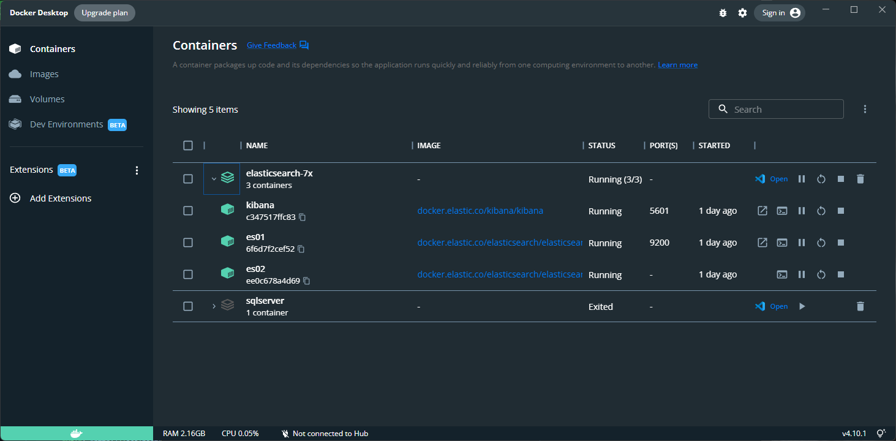

# Elasticsearch (`OrchardCore.Search.Elasticsearch`)

Elasticsearch模块允许您管理Elasticsearch索引。

## 如何使用

您可以使用像https://www.elastic.co提供的Elasticsearch云服务，也可以在本地安装它。对于开发和测试目的，也可以使用Docker部署。

### 使用Docker compose安装Elasticsearch 7.x

Elasticsearch默认使用mmapfs目录存储其索引。默认操作系统上的mmap计数限制可能太低，这可能会导致内存不足异常。

https://www.elastic.co/guide/en/elasticsearch/reference/current/vm-max-map-count.html

对于带有WSL2的Docker，您需要使用.wslconfig文件来保留此设置。

在Windows的`%userprofile%`目录（通常为`C:\Users\<username>`）中创建或编辑文件`.wslconfig`，并添加以下内容：

```
[wsl2]
kernelCommandLine = "sysctl.vm.max_map_count=262144"
```

然后退出任何WSL实例，`wsl --shutdown`，并重新启动。

```cmd
> sysctl vm.max_map_count
vm.max_map_count = 262144
```

Elasticsearch v7.17.5 Docker Compose文件： 
[docker-compose.yml](docker-compose.yml)

- 将此文件复制到名为Elasticsearch的安全文件夹中。
- 在此文件夹中打开终端或命令外壳。
- 执行`docker-compose up`以部署Elasticsearch容器。

建议：如果您想以后一次性删除所有容器，请勿从其文件夹中删除此文件。

您应该在Docker Desktop应用程序中获得此结果： 



### 在Orchard Core中设置Elasticsearch

- 在shell配置中添加弹性连接（OrchardCore.Cms.Web appsettings.json文件）。[请参阅Elasticsearch配置](#elasticsearch-configuration)。

- 使用VS Code调试器启动Orchard Core实例
- 转到Orchard Core功能，启用Elasticsearch。

## 配方步骤

可以使用`ElasticIndexSettings`步骤在配方执行期间创建Elasticsearch索引。  
以下是一个示例步骤：

```json
{
  "steps":[
    {
      "name":"ElasticIndexSettings",
      "Indices":[
        {
          "Search":{
            "AnalyzerName":"standardanalyzer",
            "IndexLatest":false,
            "IndexedContentTypes":[
              "Article",
              "BlogPost"
            ]
          }
        }
      ]
    }
  ]
}
```

## Elasticsearch设置配方步骤

以下是设置默认搜索设置的示例：

```json
{
  "steps":[
    {
      // Create the search settings.
      "name":"Settings",
      "ElasticSettings":{
        "SearchIndex":"search",
        "DefaultSearchFields":[
          "Content.ContentItem.FullText"
        ],
        "AllowElasticQueryStringQueryInSearch":false,
        "SyncWithLucene":true // Allows to sync content index settings.
      }
    }
  ]
}
```

### 重置Elasticsearch索引步骤

此重置索引步骤重置Elasticsearch索引。
从头开始重新启动索引过程，以更新当前内容项。
它不会从索引中删除现有条目。

```json
{
  "steps":[
    {
      "name":"lucene-index-reset",
      "Indices":[
        "IndexName1",
        "IndexName2"
      ]
    }
  ]
}
```

要重置所有索引：   

```json
{
  "steps":[
    {
      "name":"lucene-index-reset",
      "IncludeAll":true
    }
  ]
}
```

### 重建Elasticsearch索引步骤

此重建索引步骤重建Elasticsearch索引。
删除并重新创建完整的索引内容。

```json
{
  "steps":[
    {
      "name":"lucene-index-rebuild",
      "Indices":[
        "IndexName1",
        "IndexName2"
      ]
    }
  ]
}
```

要重建所有索引：   

```json
{
  "steps":[
    {
      "name":"lucene-index-rebuild",
      "IncludeAll":true
    }
  ]
}
```

## 查询配方步骤

以下是从查询配方步骤创建Elasticsearch查询的示例：

```json
{
  "Source": "Elasticsearch",
  "Name": "RecentBlogPosts",
  "Index": "Search",
  "Template": "...", // json encoded query template
  "ReturnContentItems": true
}
```

## Web API

### `api/elasticsearch/content`

执行具有指定名称的查询并返回相应的内容项。

动词：`POST`和`GET`

| 参数 | 示例 | 描述 |
| --------- | ---- |------------ |
| `indexName` | `search` | 要查询的索引的名称。 |
| `query` | `{ "query": { "match_all": {} } }` | 表示查询的JSON对象。 |
| `parameters` | `{ size: 3}` | 表示查询参数的JSON对象。 |

### `api/elasticsearch/documents`

执行具有指定名称的查询并返回相应的Elasticsearch文档。仅返回存储的字段。

动词：`POST`和`GET`

| 参数 | 示例 | 描述 |
| --------- | ---- |------------ |
| `indexName` | `search` | 要查询的索引的名称。 |
| `query` | `{ "query": { "match_all": {} } }` | 表示查询的JSON对象。 |
| `parameters` | `{ size: 3}` | 表示查询参数的JSON对象。 |

## Elasticsearch查询

Elasticsearch模块提供了管理UI和API，用于使用ElasticSearch查询查询Elasticsearch数据。
请参阅：https://www.elastic.co/guide/en/elasticsearch/reference/current/query-dsl.html

## Elasticsearch配置

Elasticsearch模块连接配置可以在appsettings.json文件或每个租户中全局设置。

```json
"OrchardCore_Elasticsearch": {
  "ConnectionType": "SingleNodeConnectionPool",
  "Url": "http://localhost",
  "Ports": [ 9200 ],
  "CloudId": "Orchard_Core_deployment:ZWFzdHVzMi5henVyZS5lbGFzdGljLWNsb3VkLmNvbTo0NDMkNmMxZGQ4YzBrQ2Y2NDI5ZDkyNzc1MTUxN2IyYjZkYTgkMTJmMjA1MzBlOTU0NDgyNDlkZWVmZWYzNmZlY2Q5Yjc=",
  "Username": "admin",
  "Password": "admin",
  "CertificateFingerprint": "75:21:E7:92:8F:D5:7A:27:06:38:8E:A4:35:FE:F5:17:D7:37:F4:DF:F0:9A:D2:C0:C4:B6:FF:EE:D1:EA:2B:A7",
  "EnableApiVersioningHeader": false
}
```

!!! 注意
    当使用`CloudConnectionPool`连接类型时，不需要`CertificateFingerprint`。

连接类型文档和示例可以在此URL找到：

https://www.elastic.co/guide/en/elasticsearch/client/net-api/7.17/connection-pooling.html

## Elasticsearch vs Lucene

两个模块是互补的，可以同时启用。
虽然Lucene模块使用Lucene.NET，但它不如Elasticsearch模块功能完整。

由于Lucene.NET实现了较旧版本的Lucene，因此两个模块的实现之间将存在差异。尽管最基本的类型的查询将在两个模块中都起作用。

虽然Lucene模块将始终仅从Lucene查询返回`stored`字段，但Elasticsearch模块可以设置为返回特定字段或返回整个源数据。

以下是一个将仅从Elasticsearch返回特定字段的查询示例。

```json
{
  "query": {
    "match_all": { }
  },
  "fields": [
    "ContentItemId.keyword", "ContentItemVersionId.keyword"
  ],
  "_source": false
}
```

Elasticsearch索引设置允许存储“源”数据或不存储。默认情况下，它设置为存储源数据。

Elasticsearch将根据CLR类型自动映射。传递给Elasticsearch的每个数据字段，如果映射为“string”，则将变为`text`和`keyword`。例如，`Content.ContentItem.DisplayText`将作为`text`字段，而`Content.ContentItem.DisplayText.keyword`将成为`keyword`字段，以便可以将其用作技术值。

Lucene和Elasticsearch索引字段之间可能存在差异。Lucene允许`store`并将字段显式设置为`keyword`。 Elasticsearch目前不受ContentField索引设置上的`stored`或`keyword`选项的影响。我们最终可能会允许它通过对索引执行手动映射。因此，现在，当使用相同的字段名称在查询中时，这可能会导致Lucene中的字段为`text`，而Elasticsearch中的字段为`keyword`。然后，您需要调整查询以使用正确类型的查询。

### 索引与存储

当我们说一个字段被索引时，这意味着它由配置的分析器解析，该分析器设置在索引上（Elasticsearch还允许在查询上传递自定义分析器）。

但是，当一个字段被存储时，它可以具有不同的上下文。

例如，Elasticsearch将原始值存储在其索引的“_source”字段中。所有自动映射的字段都不会存储在索引中。它们被索引。

Lucene虽然目前可以在特定索引设置上设置“存储源数据”选项时存储传递的原始值。 Lucene还具有按设计的`stored`字段，例如内容项的`ContentItemId`。

将行为与Elasticsearch中的`keyword`相同的`StringField`的等效项已通过在字段名称上使用`.keyword`后缀来添加到所有传递“string”值的ContentFields中。

以下是一个小表格，用于比较Lucene和Elasticsearch（字符串）类型：

| Lucene | Elasticsearch | 描述 |  当存储  | 搜索查询类型 |
|--------|---------------|---------------------------|-----------------|------------------|
| StringField | Keyword  | 一个被索引但不被分词的字段：整个值被索引为单个标记     | 原始值和索引 | [stored fields](https://www.elastic.co/guide/en/elasticsearch/reference/current/term-level-queries.html)因为被索引为单个标记。  |
| TextField   | Text     | 一个被索引和分词的字段，没有术语向量 | 原始值和索引  | [analyzed fields](https://www.elastic.co/guide/en/elasticsearch/reference/current/full-text-queries.html)。也称为全文搜索 |
| StoredField | 通过映射配置存储在_source中 | 包含原始值（未分析）的字段 | 原始值 | [stored fields](https://www.elastic.co/guide/en/elasticsearch/reference/current/term-level-queries.html) |
