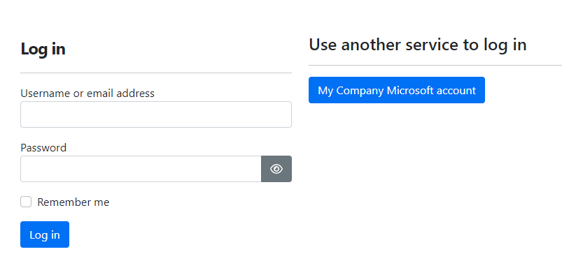

# Microsoft Authentication (`OrchardCore.Microsoft.Authentication`)

该模块配置Orchard以支持Microsoft帐户和/或Microsoft Azure Active Directory帐户。

## Microsoft Account

使用Microsoft帐户对用户进行身份验证。
如果站点允许注册新用户，则会创建本地用户并链接Microsoft帐户。
如果找到具有相同电子邮件的本地用户，则在身份验证后将外部登录链接到该帐户。

您应在[应用程序注册门户](https://apps.dev.microsoft.com)中创建应用程序并添加Web平台。

为您的应用程序命名，创建一个将用作Orchard中的AppSecret的密钥，并允许隐式流。 Orchard中的默认回调为[tenant] / signin-microsoft，或者可以根据需要设置。

可以通过管理仪表板中的_Microsoft Authentication-> Microsoft Account_设置菜单设置配置。

可用设置为：

- AppId：应用程序注册门户中的应用程序ID。
- AppSecret：Orchard将使用的应用程序密钥。
- CallbackPath：应用程序基本路径内的请求路径，用户代理将在其中返回。中间件将在到达时处理此请求。
如果未提供任何值，请设置Microsoft Account应用程序以使用默认路径/signin-microsoft。

## Azure Active Directory

使用其Azure AD帐户对用户进行身份验证，例如Microsoft工作或学校帐户。如果站点允许注册新用户，则会创建本地用户并链接Azure AD帐户。如果找到具有相同电子邮件的本地用户，则在身份验证后将外部登录链接到该帐户。

首先，您需要在[Azure门户](https://portal.azure.com)上为Azure AD租户创建Azure AD应用程序。

1.转到“Azure Active Directory”菜单，这将打开您的组织的Active Directory设置。
2.打开“应用程序注册”，然后单击“新注册”以开始创建新的应用程序注册。
3.使用以下设置：
    -名称：我们建议您的Web应用程序的名称，例如“My App”。这不是您需要在登录后指定的显示名称，也不需要与其他任何内容匹配。
    -支持的帐户类型：该功能支持单租户和多租户Azure AD，但不支持个人帐户。
    -重定向URI：虽然据说是可选的，但您必须为Web应用程序指定一个以使登录流程正常工作。添加将处理Azure AD登录重定向的URL；默认情况下，这是您的应用程序根URL下的/ signin-oidc，例如“https://example.com/signin-oidc”（登录后，用户将被重定向到他们之前访问的页面，这不是为此）。
4.创建应用程序后，请注意在Azure门户中显示的以下详细信息，这些信息将需要在Orchard Core中进行配置：
    -应用程序（客户端）ID
    -目录（租户）ID
5.在其“身份验证”菜单下配置应用程序的其余身份验证设置。在“隐式授权和混合流”下，启用“访问令牌（用于隐式流）”和“ID令牌（用于隐式和混合流）”。如果没有这些，登录将失败并显示错误。
6.在“令牌配置”菜单下配置“电子邮件”声明。单击“添加可选声明”，选择“令牌类型”为“ID”，然后选择“电子邮件”，然后单击“添加”。如果没有此项，Orchard无法根据用户的电子邮件匹配登录，因此现有用户将无法登录。

现在，您已准备好在Orchard中配置Azure AD登录。启用“Microsoft Azure Active Directory Authentication”功能后，在Orchard管理员中，您将看到“Security”→“Azure Active Directory”菜单。至少进行以下配置：

-显示名称：将在Orchard登录屏幕上显示的文本。我们建议类似于“My Company Microsoft account”的内容。
-AppId：使用Azure门户中上述“应用程序（客户端）ID”。
-TenantId：使用Azure门户中上述“目录（租户）ID”。
-CallbackPath：我们建议不更改此项，除非您想通过自定义代码处理登录回调，或者如果/sigin-oidc路径由其他内容使用。这是应用程序基本路径内的路径，在登录后用户代理将在其中返回。中间件将在到达时处理此请求。如果未提供任何值，则使用默认值/ signin-oidc，无需进一步设置。如果更改此项，则还需要在Azure门户中的应用程序的“重定向URI”下使用它。

现在，登录屏幕将显示Azure AD登录按钮：



在Orchard和Azure AD中具有相同电子邮件地址的现有用户将能够登录并附加其两个帐户。如果启用并设置了注册，新用户将能够注册，有关详细信息，请参见下文。

###配方步骤

可以使用设置步骤在配方中设置Azure Active Directory。这是一个示例步骤：

```json
{
"name": "azureADSettings",
"appId": "86eb5541-ba2b-4255-9344-54eb73cec375",
"tenantId": "4cc363b6-5254-4b8c-bc1b-e951a5fc85ac",
"displayName": "Orchard Core AD App",
"callbackPath": "/signin-oidc"
}
```

##用户注册

-如果要通过其Microsoft帐户和/或Microsoft Azure AD登录启用新用户注册站点，则必须启用和相应地设置`OrchardCore.Users.Registration`功能。
-除了在登录期间外，现有用户可以通过用户菜单中的外部登录链接将其帐户链接到其Microsoft帐户和/或Microsoft Azure AD登录。

## Microsoft Account＆Azure Active Directory设置配置

`OrchardCore.Microsoft.Authentication`模块允许用户使用配置值覆盖通过在初始化应用程序时在`OrchardCoreBuilder`上调用`ConfigureMicrosoftAccountSettings（）`或`ConfigureAzureADSettings（）`扩展方法从管理区域配置的设置。

可以自定义以下配置值：

```json
    "OrchardCore_Microsoft_Authentication_MicrosoftAccount": {
      "AppId": "",
      "AppSecret": "",
      "CallbackPath": "/signin-microsoft",
      "SaveTokens": false
    }
```

```json
    "OrchardCore_Microsoft_Authentication_AzureAD": {
      "DisplayName": "",
      "AppId": "",
      "TenantId": "",
      "CallbackPath": "/signin-oidc",
      "SaveTokens": false
    }
```

有关更多信息，请参见[Configuration]（../../core/Configuration/README.md）。
> 该文档由ChatGPT 4 翻译
