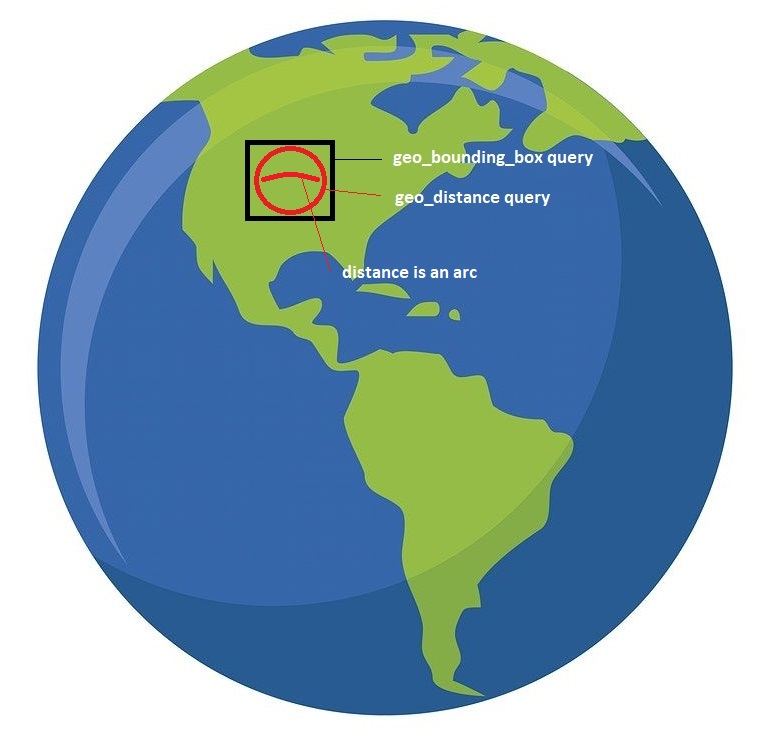

# 空间 (OrchardCore.Spatial)

该模块提供了一个**GeoPointField**，可用于为内容提供地理位置。

## Lucene Geo Queries

有关详细信息，请参见https://www.elastic.co/guide/en/elasticsearch/reference/current/geo-queries.html。

## 术语规范

`geo_bounding_box`：查找给定的顶部、左侧、底部、右侧坐标内的文档。不评估中心点与其边界之间的距离。

`geo_distance`：从给定的中心点和指定单位（km、miles...）的距离中查找文档。确实评估每个文档与此给定中心点之间的精确距离。它使用Haversine数学公式来评估每个文档及其中心点的距离。这意味着您应该尝试使用`geo_bounding_box`来限制其在大型数据集上评估的文档以提高性能。

`distance`：距离不是线性的，因为地球是圆的，这就是为什么它被称为“直线距离”。

参见：  
https://en.wikipedia.org/wiki/As_the_crow_flies  
https://en.wikipedia.org/wiki/Haversine_formula

## 地理边界框

使用边界框返回基于点位置的文档的过滤查询。`geo_bounding_box`通常用于快速检索记录而不必考虑精度。

假设BlogPost内容项具有名为Location的`GeoPointField`，其值为`[Lat:-33，Long:138]`。  
以下是查找所有具有添加到区域内的位置字段的BlogPost内容项的示例lucene查询。

```json
// Example lucene query parameters
// { "top": -33, "left": 137, "bottom" :-35, "right" : 139 }

{
    "query": {
        "bool" : {
            "must" : {
                "match_all" : {}
            },
            "filter" : {
                "geo_bounding_box" : {
                    "BlogPost.Location" : {
                        "top_left" : {
                            "lat" : {{top}},
                            "lon" : {{left}}
                        },
                        "bottom_right" : {
                            "lat" : {{bottom}},
                            "lon" : {{right}}
                        }
                    }
                }
            }
        }
    }
}
```

这将返回一个结果，假设您有一个具有**Geopoint Field with Lat -34，Long 138**的内容项。

有关详细信息，请参见ElasticSearch文档： 
https://www.elastic.co/guide/en/elasticsearch/reference/current/query-dsl-geo-bounding-box-query.html

## 地理距离

返回距离地理点特定距离内存在的文档的过滤查询。

假设BlogPost内容项具有名为Location的`GeoPointField`，其值为`[Lat:-33，Long:138]`

```json
{
    "query": {
        "bool" : {
            "must" : {
                "match_all" : {}
            },
            "filter" : {
                "geo_distance" : {
                    "distance" : "200km",
                    "BlogPost.Location" : {
                        "lat" : -34,
                        "lon" : 138
                    }
                }
            }
        }
    }
}
```

注意：200公里半径相当于从地理点中心开始的约1.7986度的弧度。因此，在`[-34.8，138]`处搜索应大于距离内容位置200公里，并且不返回其作为结果。

以下是将`geo_bounding_box`与`geo_distance`过滤查询组合的另一个查询。它们应该一起使用以加快查询结果，因为通常希望在数据库保存的记录数量较少的记录上评估距离以提高性能：

可视化表示：



```json
{
  "query": {
    "bool": {
      "must": [
        {
          "term": {
            "Content.ContentItem.ContentType.keyword": "Acme"
          }
        },
        {
          "bool": {
            "filter": {
              "geo_distance": {
                "distance": "200km",
                "Location": {
                  "lat": -33,
                  "lon": 137
                }
              }
            }
          }
        }
      ],
      "filter": {
        "geo_bounding_box": {
          "Location": {
            "top_left": {
              "lat": {{top}},
              "lon": {{left}}
            },
            "bottom_right": {
              "lat": {{bottom}},
              "lon": {{right}}
            }
          }
        }
      }
    }
  }
}
```

有关详细信息，请参见ElasticSearch文档：  
https://www.elastic.co/guide/en/elasticsearch/reference/current/query-dsl-geo-distance-query.html
> 该文档由ChatGPT 4 翻译
