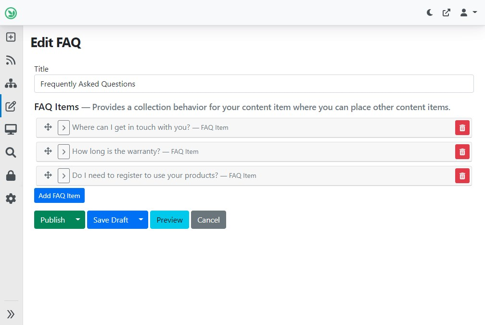
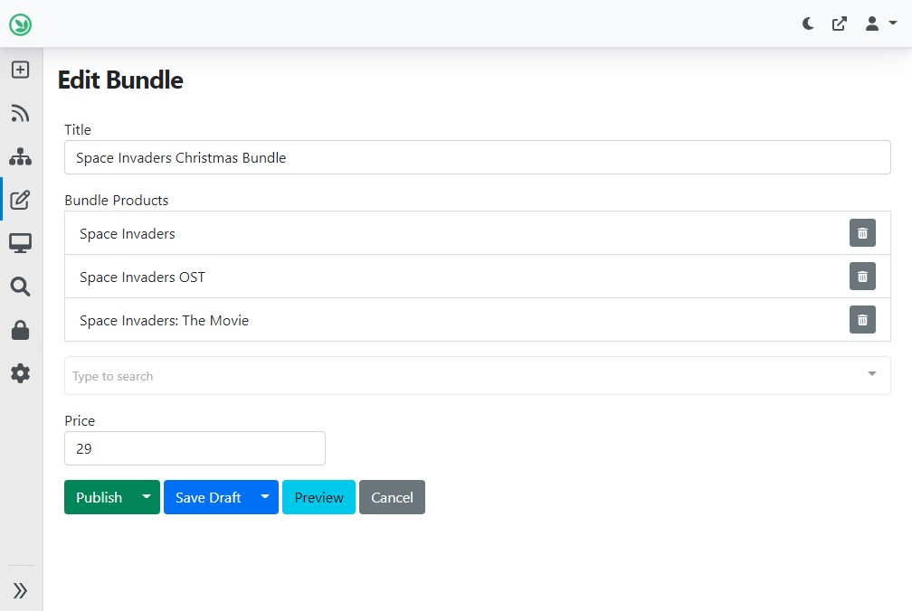
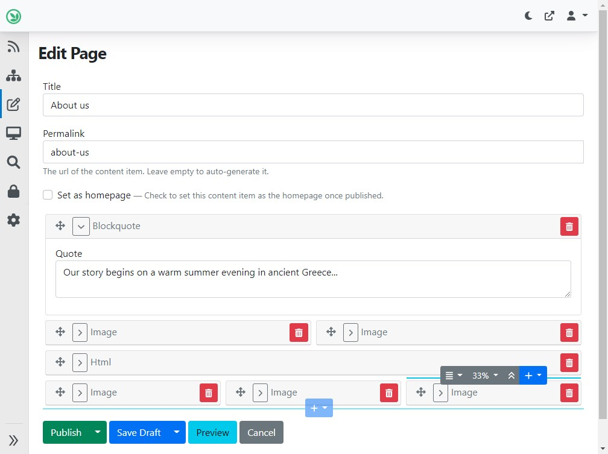
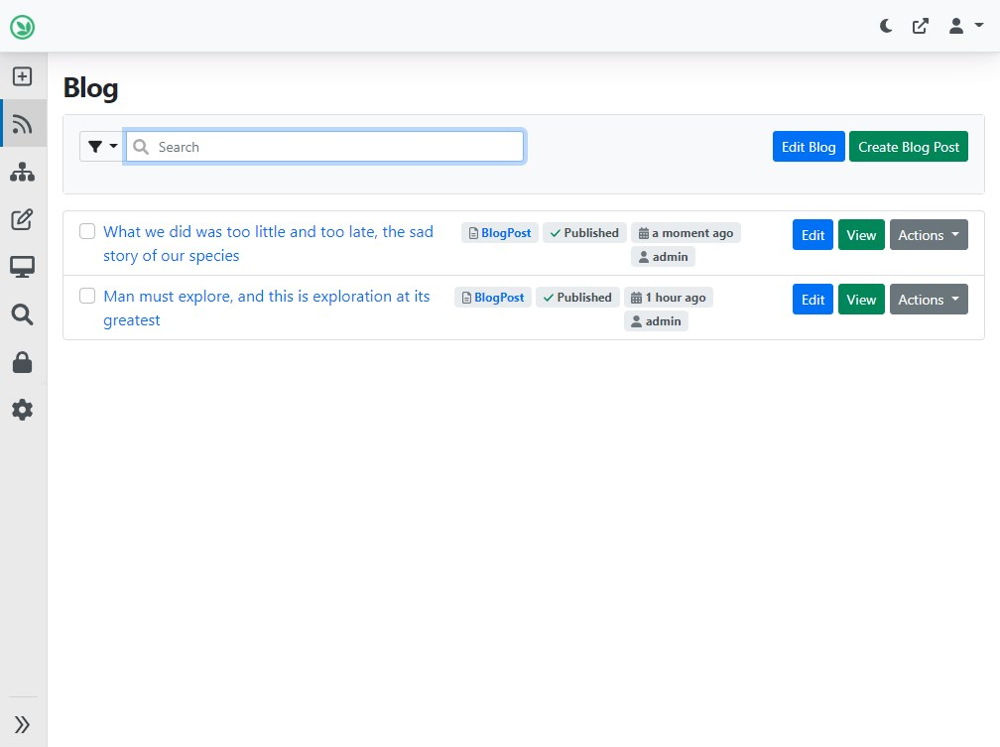
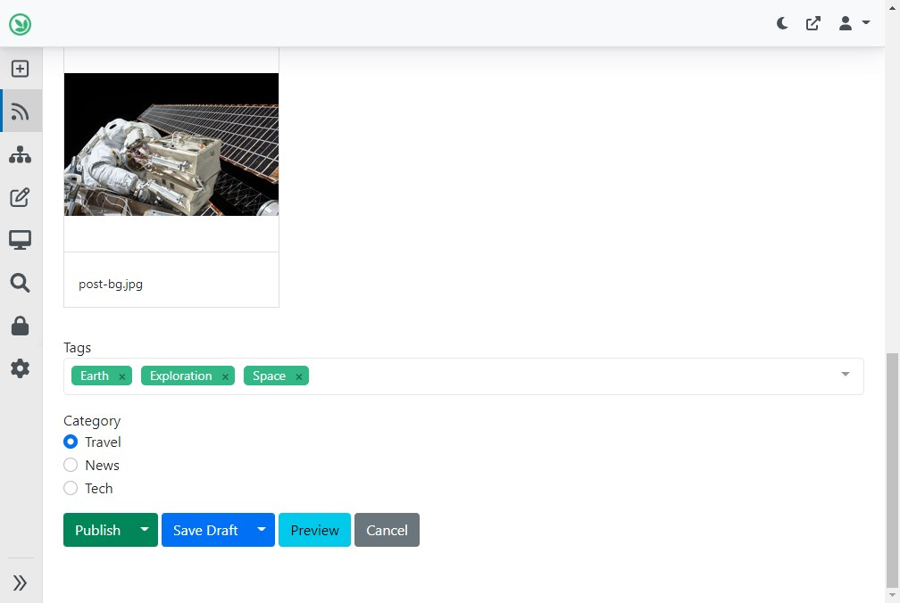
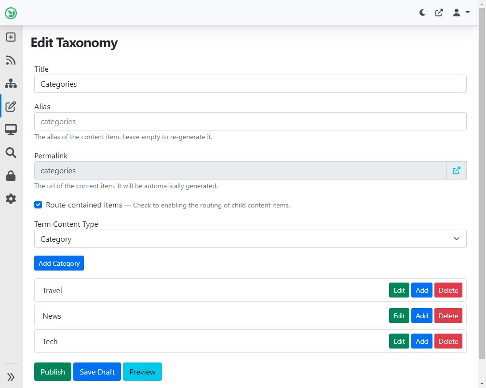

# 内容关系

你如何将一个内容条目与其他内容条目关联（连接）起来？你应该在什么时候使用每个内置选项？本指南旨在澄清可用选项。

！！！ 注意
    这是内置选项的快速概述。然而，你可以为自定义内容实施自己的实现。查看Orchard源代码以获取灵感。

！！！提示
    如果你在代码中使用下面提到的内容关系特性，请注意还有相应的索引表供快速查询。

## 袋装部件(`BagPart`)用于将内容条目嵌入到父条目中

BagPart可以按指定顺序包含其他内容项。包含的项存储在它们的父项中，因此您可以在同一个编辑器中编辑所有这些内容，它们从数据库检索速度也很快。由于它是一种命名（可重复使用）部件，因此您还可以将多个Bag Part附加到相同的内容类型上。但是，您不能直接添加现有的内容项，只能添加新内容项。在这里了解有关BagPart的更多信息。

！！！ 示例
    在讨论常见问题（FAQ）页面时，建议将每个问题-答案对（FAQ项）建模为它自己的内容类型。这样，用户可以按照现有模式快速添加项目。FAQ项目可以存储在父FAQ内容项上的Bag Part中。

如上例中类似FAQ页面的编辑器：

## 针对特定项目的多对多关系的内容选择器字段

内容选择器字段可用于选择与给定内容条目相关的一个或多个其他任意内容项。此外，您可以在一个内容部分（实际上是内容类型）中附加任意数量的内容选择器字段，从而允许您管理每个项目的多个这样的关系。在这里了解更多关于内容选择器字段的内容。

!!! 例子
    在电子商务网站的产品目录中，您可以有产品的捆绑包：人们可以购买单个产品，但捆绑包是一个特别优惠的选择。可以使用内容选择器字段为捆绑包选择产品。同样，在博客中，您可以使用内容选择器字段选择相关的博客文章，并在每篇文章下显示推荐的进一步阅读内容。

产品包项目编辑器，其中选择了产品：

!!! 注意
    虽然这不仅仅涉及内容项关系，但还有可以将用户帐户连接到内容项的用户选择器字段。

## 用于构建结构化、响应式布局的流部分（`FlowPart`）

如果您不仅想在另一个项目下列出内容项，而且还想指定它们将以什么布局结构显示，那么流部分就是答案。使用流部分，您可以将[小部件](../../reference/modules/Widgets/README.md)添加到画布，并指定它们相对于彼此显示的位置。这可用于构建具有复杂布局的页面。类似于上面的Bag部分，小部件存储在父内容项中。在这里了解更多关于流部分的内容。

!!! example
    灵活、临时的网页适合使用 Flow Part 构建。您可以创建例如about、contact 或 portfolio页面。请查看[博客主题](../../getting-started/starter-recipes.md#theblogtheme-and-blog-recipe)中的“页面”内容类型如何使用 Flow Part。

使用 Flow Part 的“关于我们”页面编辑器：

## 用于一对多分层关系的列表 Part

使用列表 Part，您可以将两个本质上独立管理的内容项在一对多关系中连接起来。这些内容项可以通过它们的 URL 直接打开和获取，但其中一个包含在另一个中。了解有关 List Part 的更多信息 [在这里](../../reference/modules/Lists/README.md)。

!!! example
    一个博客与其中包含的博客帖子之间的关系是使用 List Part 的典型示例。请查看[博客主题](../../getting-started/starter-recipes.md#theblogtheme-and-blog-recipe)中的“博客”内容类型如何使用 List Part 包含博客帖子。

博客中的博客帖子内容项列表：

## 分类和标记法的分类法
Taxonomies模块是关于使用术语对内容进行分类和标记。然后你可以列出拥有给定术语的所有内容项，例如所有带有“探索”标签的博客文章。在某种程度上，Taxonomies的术语内容项提供了一种间接的内容项多对多关系。在[这里](../../reference/modules/Taxonomies/README.md)学习更多有关Taxonomies的知识。

!!! example
    博客文章的标签和新闻文章的类别可以使用Taxonomies。Term也可以是层次结构，所以例如类别可以有子类别。请查看在[博客食谱](../../getting-started/starter-recipes.md#theblogtheme-and-blog-recipe)中，博客文章内容类型的建模方式。

博客文章内容项下的标记和类别分类术语：

具有术语的分类Taxonomy的编辑器：

> 该文档由Chat-GPT 翻译
